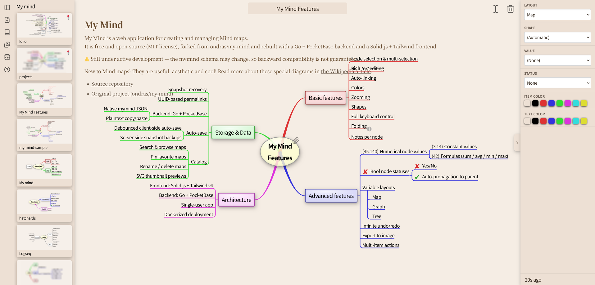
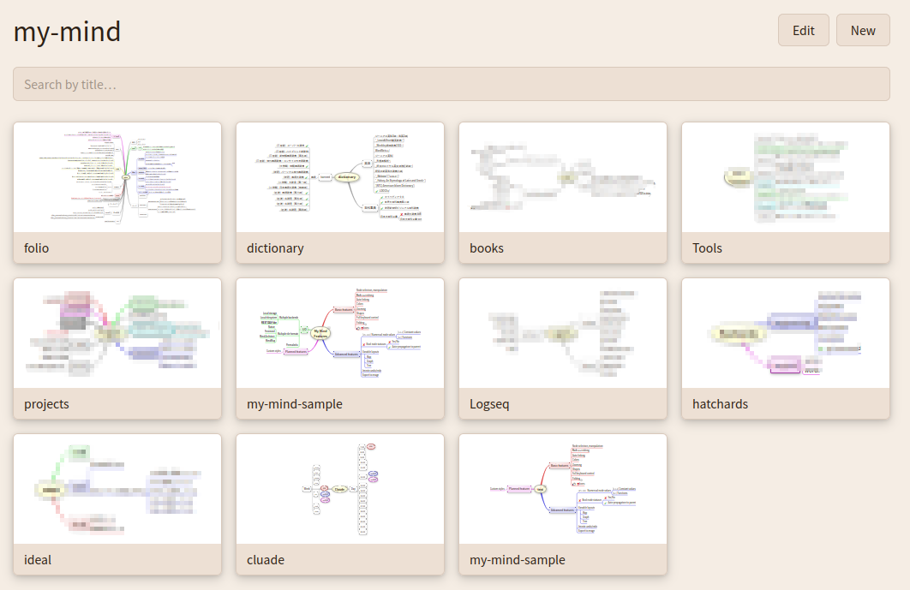

# My Mind

>[!CAUTION]
>This app is still under development, and the mymap schema may change. To keep the design simple, backward compatibility is not considered. Therefore, it is not suitable for general use, but you are free to fork it if needed.

My Mind is a web application for creating and managing Mind maps.  
New to Mind maps? They are useful, aesthetic and cool! Read more about these special diagrams in [the Wikipedia article](https://en.wikipedia.org/wiki/Mind_map).

It has a catalog feature.

## Plan
### Frontend
- [x] データ保存コードの整理: マインドマップを保存する経路が2, 3種類ある。自動保存によるmymind形式のみのデータ転送と手動保存によるmymind+svgのデータ転送。保存部分だけ、ファイルを分割したほうがよさそう。
- [x] Catalog遷移時に、svgデータの自動保存
- [x] catalogにおいて、タイトルをクリックしてもそのマップを開くようにする（現在イメージの部分しかクリック可能ではない）
- [x] Catalogにおいて、SVGイメージに埋め込まれたURLなどを誤ってクリックしないように、マウスで選択不可能にする
- [x] my-mind.js アンマウント安全化
- [x] Mindmap Engine → Solid Reactive State: Migration Plan
- [x] canvasで、Catalogアイコンや、タイトル、エディターボタンなどのある細長い部分を、topbarなどのコンポーネント化する
- [x] Canvasで、Map削除ボタンを追加する

- [ ] クライアントサイドでの自動転送（保存）機能の無効化と有効化を切り替えるトグルスイッチ（デフォルトでは無効化）
- [ ] フロントエンドにおいて自動保存アルゴリズムの調整（スナップショットロード時に自動バックアップされないようにする）

- [ ] Canvasにおいて、URLはURLとわかるように色を変えて下線をひくCSSにする

- [ ] マークダウンエディタで、画像の貼り付けを無効化する（データベースの圧迫を防ぐため）

- [ ] CanvasのSave Asボタンで、マインドマップのpng画像をクリップボードにコピーする
- [ ] 落書き機能（フリーライティング）
- [ ] ノードの移動をdnd-kitに変えられないか検討する

- [ ] Undo/Redoボタンの設置
- [ ] hotkeys-js でショートカットキーを扱えないか検討する

### Backend
- [x] マインドマップのスナップショットのサーバサイドでの自動保存（例, 1分ごと30世代、10分ごと24世代、1時間ごと7日。変更がない場合はスキップ）
- [ ] UUIDv7へ移行
- [ ] svg画像を配信するルートを作成。http://localhost:3001/img/UUID

## Work in Progress
- [ ] MarkodwonエディタをMilkdownに変更

## Ref
- [ondras/my-mind](https://github.com/ondras/my-mind)/ Demo: https://my-mind.github.io/
- “ladigitale/digimindmap: Une application en ligne pour créer des cartes mentales - Codeberg.org”. Codeberg.org, [https://codeberg.org/ladigitale/digimindmap](https://codeberg.org/ladigitale/digimindmap), (Accessed 2026-07-15) https://ladigitale.dev/digimindmap/#/m/042ac87be2cbb57b
- “BaffinLee/mindmap: Simple online mindmap editor”. GitHub, [https://github.com/BaffinLee/mindmap](https://github.com/BaffinLee/mindmap), (Accessed 2026-07-15)

icon:
- https://phosphoricons.com/
