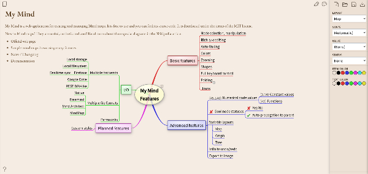

# My Mind
驚くべきことに、自分が求めているWebで動作するマインドマップアプリがGithubにまったくなかった。ondras/my-mindをリバースエイジングするしかない。
- My Mind: https://github.com/ondras/my-mind
- Demo: https://my-mind.github.io/



## 概要
- Generic Web DAVで、FQDN/mapsを登録。https://my-mind.app.internal/maps
- 以降、保存したURLを使ってマインドマップを開く。https://my-mind.app.internal/?url=https%3A%2F%2Fmy-mind.app.internal%2Fmaps%2Ftest.mymind
- 新規ファイルから保存しようとすると、既存のマインドマップを上書きしてしまう危険性がある。


## 設計
- アプリ側がSchemeやホスト名を知る必要はない。それらはリバースProxyに責任

## 計画
- メニューを作成したい

## Makefile

- static/my-mind.jsをsrcから生成する。中間ファイルは.jsに保存される。
- nix-shellに入ってから、make。
- 生成物を削除するには、make clean。
```shell
nix-shell
make

make deploy
```
